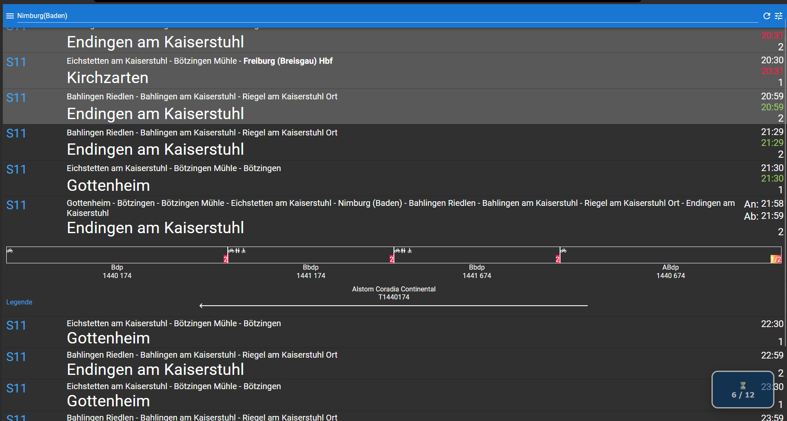
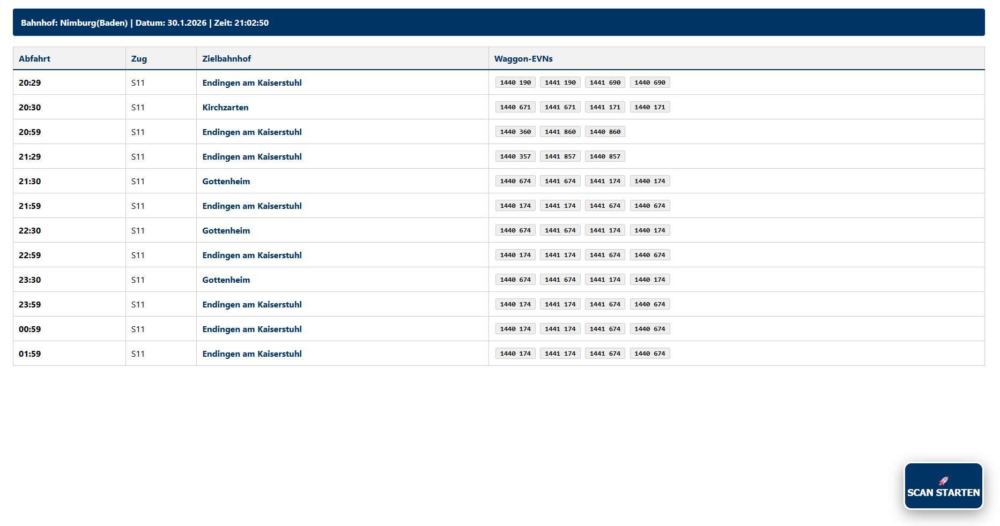

# EVN-Harvester 
This is a userscript. A browser extension, that can be used with Tampermonkey. EVN Harvester collects details from timetables at bahn.expert and creates a list from the found data. It requires the setting for EVN to be set to active (blue). And Popups have to be allowed for the page as well. Once this Script is active a button will apear on bahn.expert. If you click it, the script will collect certain data from the timetable. Take a look at the images for a first impression. It has been tested with Firefox 147.02 . 

